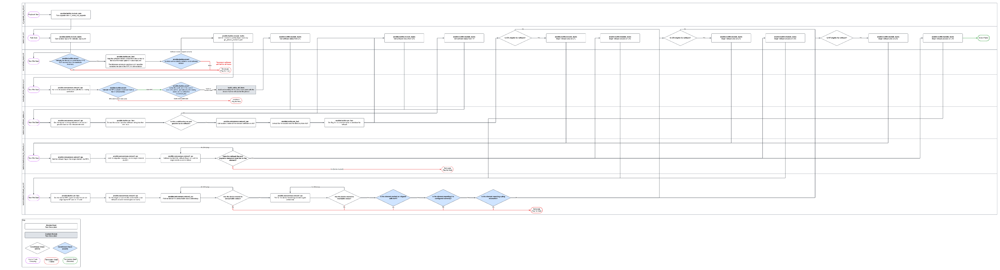

cf_nokia_olt_rollback
=========

This role has been developed to allow a graceful rollback of Nokia OLT elements from v24 software to v22. This has been developed as a separate role as the process runs in reverse to the OS upgrade process and requires several RPCs to be deployed prior to beginning the process, so that the device can safely roll back to an earlier major version.

As this process is currently valid for v24 > v22, the OLT must be running software version L6GQFC24.299 and the only version that can be rolled back to is L6GQAG22.667. Any extension or update to this may require a change in flow or RPCs.

The latest task workflow can be found [here](https://lucid.app/lucidchart/2603a0a6-7ca9-491f-aa1f-3a97ef0e7f2a/edit?viewport_loc=-985%2C610%2C5226%2C2233%2C2kIWfRlVDPB~&invitationId=inv_fe2a7711-a536-46c8-beb7-dc82c331fd15)

Requirements
------------

All requirements are coupled with the overall repo, the ansible modules used include:

- ansible.builtin
- ansible.netcommon

Custom modules:

- build_nokia_olt_facts

The custom action module was built to properly format the inventory for operation in the role due to limitations with data manipulation in Ansible's DSL. This module can be found in library/build_nokia_olt_facts.py. Pydantic is the main 3rd party requirement for this module and has been added to the EE environment build manifests [here](https://bitbucket.org/cityfibre/awx-ee/src/main/)

All connectivity is proxied via AVP, therefore host must have access to avp.cityfibre.cloud on TCP 6514.

Role Variables
--------------

#### defaults.yml

Variables in default are to define the variable and type, for anything that is used as logic driven tests at the beginning of the play. I.e. these are needed to execute the role.

| Variable                                          | Type / Default    | Function                                                                                                                                                                                                                                               |
| ------------------------------------------------- | ----------------- | ------------------------------------------------------------------------------------------------------------------------------------------------------------------------------------------------------------------------------------------------------ |
| cf_nokia_olt_rollback__allow_rollback_process     | dict\[str,bool\]  | Contains the logic for allowing the rollback process for each element, this is dynamically checked at the beginning of the role and if any element doesn't meet the criteria, it will be skipped. This allows us to run against half migrated devices. |
| cf_nokia_olt_rollback__allow_rollback_process.NT  | bool              | Used to drive the conditional for whether or not the rollback process will be engaged on the NT card.                                                                                                                                                  |
| cf_nokia_olt_rollback__allow_rollback_process.LT1 | bool              | Used to drive the conditional for whether or not the rollback process will be engaged on the LT1 card.                                                                                                                                                 |
| cf_nokia_olt_rollback__allow_rollback_process.LT2 | bool              | Used to drive the conditional for whether or not the rollback process will be engaged on the LT2 card.                                                                                                                                                 |

#### vars/main.yml

Variables in vars/main.yml control operations of the playbook.

| Variable                                                 | Type / Default   | Function                                                                                                                    |
| -------------------------------------------------------- | ---------------- | --------------------------------------------------------------------------------------------------------------------------- |
| cf_nokia_olt_rollback__valid_admin_state                 | list\[str\]      | List of valid states the card admin state can be in when checking the card state                                            |
| cf_nokia_olt_rollback__valid_oper_state                  | list\[str\]      | List of valid states the card operational state can be in when checking the card state                                      |
| cf_nokia_olt_rollback__valid_standby_state               | list\[str\]      | List of valid states the card standby states can be in when checking the card state                                         |
| cf_nokia_olt_rollback__valid_rollback_from               | str              | String representation of the valid software version we can rollback from (checked against whats running in the active bank) |
| cf_nokia_olt_rollback__valid_rollback_to                 | str              | String representation of the valid software version we can rollback to (checked against whats running in the passive bank)  |
| cf_nokia_olt_rollback__check_timers                      | dict\[str,dict\] | Contains all the timers we'll use for retries in each checking state                                                        |
| cf_nokia_olt_rollback__check_timers.rollback_state       | dict\[str,int\]  | Controls how long we'll wait for the rollback RPCs to complete successfully                                                 |
| cf_nokia_olt_rollback__check_timers.firmware_download    | dict\[str,int\]  | Controls how long we'll wait for setting the active software RPCs to complete successfully                                  |
| cf_nokia_olt_rollback__check_timers.poll_for_unreachable | dict\[str,int\]  | Controls how long we'll wait for the RPC that polls for the OLT to go unreachable (rebooting after config)                  |
| cf_nokia_olt_rollback__check_timers.reboot               | dict\[str,int\]  | Controls how long we'll wait for the RPC that polls for the OLT to return after rebooting                                   |

Dependencies
------------

- Module / Custom dependencies are all wrapped up in the awx_dme repo
- Requires 'Autotools Dynamic Inventory' as a source for a constructed inventory

Example Playbook
----------------

The playbook for this role is defined in the root of the repo, cf_nokia_olt_rollback.yml

Author Information
------------------

[simon.mckelvey@cityfibre.com](mailto:simon.mckelvey@cityfibre.com)

