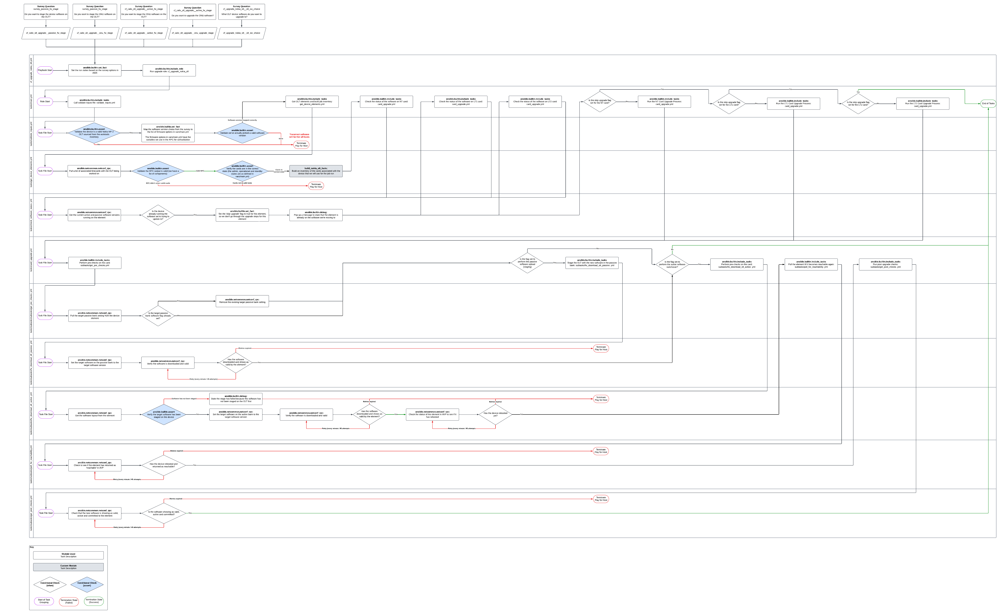

cf_nokia_olt_upgrade
====================

This role can be used to upgrade a Nokia MF-2 OLT to a desired software version. Because the Nokia MF-2 OLT is comprised of several elements that make up the OLT, this role operates slightly differently in that it runs in the overall 'device' context, but we use RPCs to pull back the line cards and run them in the overall device context. This has meant a lot of conditionality has been added into this role.

The latest task workflow can be found [here](https://lucid.app/lucidchart/f0c73b00-0d2c-4b7e-9fe9-1af39b13aa44/edit?viewport_loc=91%2C403%2C2944%2C2122%2C2kIWfRlVDPB~&invitationId=inv_f32945d5-2d2b-4346-962f-ae33681f54de)



Requirements
------------

All requirements are coupled with the overall repo, the ansible modules used include:

- ansible.builtin
- ansible.netcommon

Custom modules:

- build_nokia_olt_facts

The custom action module was built to properly format the inventory for operation in the role due to limitations with data manipulation in Ansible's DSL. This module can be found in library/build_nokia_olt_facts.py. Pydantic is the main 3rd party requirement for this module and has been added to the EE environment build manifests [here](https://bitbucket.org/cityfibre/awx-ee/src/main/)

All connectivity is proxied via AVP, therefore host must have access to avp.cityfibre.cloud on TCP 6514.

**Note**: I have had issues targeting AVP directly from my dev machine, whereby SSH failed to connect when using more than 2 forks. This issue is not prevalent if you run from the prod subnet (10.0.51.0/24). I have had no confirmation from IT as to the reason for this.

Role Variables
--------------

#### defaults.yml

Variables in default are to define the variable and type, for anything that is used as logic driven tests at the beginning of the play. I.e. these are needed to execute the role.

| Variable                                       | Type / Default    | Function                                                                                                                                                                                                                                                                    |
| ---------------------------------------------- | ----------------- | --------------------------------------------------------------------------------------------------------------------------------------------------------------------------------------------------------------------------------------------------------------------------- |
| cf_nokia_olt_upgrade__debug                    | bool (false)      | Used as as condition to trigger debug tasks in the development of the role                                                                                                                                                                                                  |
| cf_nokia_olt_upgrade__olt_sw                   | None (null)       | Used to define the mapping from the software choice on the AWX survey, to the software with its relevant vars for running the playbook                                                                                                                                      |
| cf_nokia_olt_upgrade__passive_fw_stage         | bool (false)      | Controls whether or not we run the staging step                                                                                                                                                                                                                             |
| cf_nokia_olt_upgrade__active_fw_stage          | bool (false)      | Controls whether or not we run the flip to active step (the upgrade process)                                                                                                                                                                                                |
| cf_nokia_olt_upgrade__skip_upgrade_process     | dict\[str, bool\] | Parent key for the following keys                                                                                                                                                                                                                                           |
| cf_nokia_olt_upgrade__skip_upgrade_process.NT  | bool (false)      | This flag is set in the play in check_software_status.yml if we detect through the RPC calls the particular element is already on the software we're upgrading to. This allows for partial upgrades / upgrade recoveries, where the NT could be upgraded but the LT is not. |
| cf_nokia_olt_upgrade__skip_upgrade_process.LT1 | bool (false)      | ^                                                                                                                                                                                                                                                                           |
| cf_nokia_olt_upgrade__skip_upgrade_process.LT2 | bool (false)      | ^                                                                                                                                                                                                                                                                           |

#### vars/main.yml

Variables in vars/main.yml control operations of the playbook.

| Variable                                                        | Type / Default            | Function                                                                                                                                                                                                                                                                                                                                             |
| --------------------------------------------------------------- | ------------------------- | ---------------------------------------------------------------------------------------------------------------------------------------------------------------------------------------------------------------------------------------------------------------------------------------------------------------------------------------------------- |
| cf_nokia_olt_upgrade__rpc                                       | dict\[str,dict\]          | Contains mappings for all the RPCs that are used for the upgrade process.                                                                                                                                                                                                                                                                            |
| cf_nokia_olt_upgrade__rpc.common                                | dict\[str, dict\]         | Contains mappings for all the common RPCs used in each upgrade flow (v22 / v24 etc). These are mostly get / get-config RPCs and are used regardless of what version of software exists on AVP or the OLT.<br><br>YAML anchors are used to allow for merging these into the OS specific data structure defined in cf_nokia_olt_upgrade__olt_images.\* |
| cf_nokia_olt_upgrade__rpc.\*                                    | dict\[str, dict\]         | Contains mappings for any OS specific RPCs when performing the upgrade process. For example, v22 and v24 have different RPCs for setting the active software bank.                                                                                                                                                                                   |
| cf_nokia_olt_upgrade__rpc.\*.nt                                 | dict\[str, str\]          | Contains mappings for any element specific RPCs when performing the upgrade process, for example there are different RPCs whether you are targeting the NT vs LT card.                                                                                                                                                                               |
| cf_nokia_olt_upgrade__rpc.\*.lt                                 | dict\[str, str\]          | Contains mappings for any element specific RPCs when performing the upgrade process, for example there are different RPCs whether you are targeting the NT vs LT card.                                                                                                                                                                               |
| cf_nokia_olt_upgrade__olt_images                                | dict\[str, dict\]         | Dictionary containing all the possible software options containing the values that map to software in AVP, along with the RPC mappings for that particular path                                                                                                                                                                                      |
| cf_nokia_olt_upgrade__olt_images.\*                             | str                       | The string key for the software that will be used for the upgrade e.g. v22_02_mp01 or v24_6_2                                                                                                                                                                                                                                                        |
| cf_nokia_olt_upgrade__olt_images.\*.image_name                  | str                       | Name of the image as defined in AVP > Software Images, used for the RPC templates to choose the software to push to the device                                                                                                                                                                                                                       |
| cf_nokia_olt_upgrade__olt_images.\*.image_dir                   | str                       | Name of the image directory as defined in AVP > Software Images, used for the RPC templates to choose the software to push to the device                                                                                                                                                                                                             |
| cf_nokia_olt_upgrade__olt_images.\*.software_name               | str                       | Software product name as defined by Nokia, used for validating the RPC responses when software is downloaded, installed and activated                                                                                                                                                                                                                |
| cf_nokia_olt_upgrade__olt_images.\*.rpc                         | dict\[str, dict\]         | Uses YAML anchors to merge in the relevant RPCs defined in cf_nokia_olt_upgrade__rpc. This means we only have to define RPCs for common and per-software version in one place, and they are then automatically merged in when the YAML is parsed. Reduces the risk of errors due to data repetition.                                                 |
| cf_nokia_olt_upgrade__json_filter                               | dict\[dict, str\]         | Contains all the json_query filters used in conditionals in the play                                                                                                                                                                                                                                                                                 |
| cf_nokia_olt_upgrade__json_filter.sw_is_defined                 | str                       | Used in a conditional check to ensure the software image we've downloaded to the element has been defined                                                                                                                                                                                                                                            |
| cf_nokia_olt_upgrade__json_filter.sw_is_active                  | str                       | Used in a conditional check to ensure the software image we've downloaded to the element is active on the element                                                                                                                                                                                                                                    |
| cf_nokia_olt_upgrade__json_filter.sw_is_committed               | str                       | Used in a conditional check to ensure the software image we've downloaded to the element is committed to the element                                                                                                                                                                                                                                 |
| cf_nokia_olt_upgrade__json_filter.sw_is_valid                   | str                       | Used in a conditional check to ensure the software image we've downloaded to the element is seen as valid to the element                                                                                                                                                                                                                             |
| cf_nokia_olt_upgrade__valid_admin_state                         | list\[str\]               | List of valid states the card admin state can be in when checking the card state                                                                                                                                                                                                                                                                     |
| cf_nokia_olt_upgrade__valid_oper_state                          | list\[str\]               | List of valid states the card operational state can be in when checking the card state                                                                                                                                                                                                                                                               |
| cf_nokia_olt_upgrade__valid_standby_state                       | list\[str\]               | List of valid states the card standby states can be in when checking the card state                                                                                                                                                                                                                                                                  |
| cf_nokia_olt_upgrade__check_timers                              | dict\[dict\[dict, int\]\] | Contains variables that control how long we wait in certain states for the condition to become true                                                                                                                                                                                                                                                  |
| cf_nokia_olt_upgrade__check_timers.firmware_download            | dict\[dict\[int\]\]       | Contains varialbes that control how long we wait for the firmware to download to the element                                                                                                                                                                                                                                                         |
| cf_nokia_olt_upgrade__check_timers.firmware_download.retries    | int                       | How many times we will retry until the condition becomes true or fails                                                                                                                                                                                                                                                                               |
| cf_nokia_olt_upgrade__check_timers.firmware_download.delay      | int                       | How long we will wait between retries                                                                                                                                                                                                                                                                                                                |
| cf_nokia_olt_upgrade__check_timers.poll_for_unreachable         | dict\[dict\[int\]\]       | Contains varialbes that control how long we wait for the device to become unreachable                                                                                                                                                                                                                                                                |
| cf_nokia_olt_upgrade__check_timers.poll_for_unreachable.retries | int                       | How many times we will retry until the condition becomes true or fails                                                                                                                                                                                                                                                                               |
| cf_nokia_olt_upgrade__check_timers.poll_for_unreachable.delay   | int                       | How long we will wait between retries                                                                                                                                                                                                                                                                                                                |
| cf_nokia_olt_upgrade__check_timers.reboot                       | dict\[dict\[int\]\]       | Contains varialbes that control how long we wait for the device to become unreachable                                                                                                                                                                                                                                                                |
| cf_nokia_olt_upgrade__check_timers.reboot.retries               | int                       | How many times we will retry until the condition becomes true or fails                                                                                                                                                                                                                                                                               |
| cf_nokia_olt_upgrade__check_timers.reboot.delay                 | int                       | How long we will wait between retries                                                                                                                                                                                                                                                                                                                |

Software Images, RPCs and Logic Flow
-------------------------------------
### Overview

To fit within the Ansible structure, all variables for driving the upgrade process, along with the RPCs, are defined in vars/main.yml.

This role uses jinja2 templates to represent the RPCs, and uses a mapping structure inside the **cf_nokia_olt_upgrade__rpc** to represent a mapping between the RPC type, the jinja2 template and then uses a structure to merge that into the OS-specific process in **cf_nokia_olt_upgrade__olt_images**.

```yaml
cf_nokia_olt_upgrade__rpc:
  common: &common_rpc
    get_device_connection_status: "templates/common/get_device_connection_status.jinja2"
    get_linecards: "templates/common/get_linecards.jinja2"
    get_onu_list: "templates/common/get_onu_list.jinja2"
    get_onu_status: "templates/common/get_onu_status.jinja2"
    get_sw_current_layout: "templates/common/get_sw_current_layout.jinja2"
    get_sw_download_status: "templates/common/get_sw_download_status.jinja2"
    getcfg_target_passive_sw: "templates/common/getcfg_target_passive_sw.jinja"
  v22: &v22_rpc
    nt:
      remove_target_passive_sw: "templates/v22/remove_target_passive_sw.jinja2"
      set_target_active_sw: "templates/v22/set_target_active_sw.jinja2"
      set_target_passive_sw: "templates/v22/set_target_passive_sw.jinja2"
    lt:
      remove_target_passive_sw: "templates/v22/remove_target_passive_sw.jinja2"
      set_target_active_sw: "templates/v22/set_target_active_sw.jinja2"
      set_target_passive_sw: "templates/v22/set_target_passive_sw.jinja2"
  v24: &v24_rpc
    nt:
      remove_target_passive_sw: "templates/v24/remove_target_passive_sw.jinja2"
      set_target_active_sw: "templates/v24/set_target_active_sw_nt.jinja2"
      set_target_passive_sw: "templates/v24/set_target_passive_sw.jinja2"
    lt:
      remove_target_passive_sw: "templates/v24/remove_target_passive_sw.jinja2"
      set_target_active_sw: "templates/v24/set_target_active_sw_lt.jinja2"
      set_target_passive_sw: "templates/v24/set_target_passive_sw.jinja2"
```
To allow for the role logic to remain consistent, this structure has been defined to allow for common RPCs to be defined (which can be inherited in multiple software versions) along with version specific RPCs to be defined (which can be inherited by that software version) meaning we don't have to add a bunch of conditionality into the role / playbook, we just define the RPCs by mapping the OS version to the RPC definitions.

For example, the v22 upgrade process uses the same RPCs for both LT and NT when setting passive / active software version, whereas the v24 upgrade process uses a slightly different RPC for both LT and NT. As such, the role is referencing the variables and the value is mapping to a different RPC template.

```yaml
cf_nokia_olt_upgrade__olt_images:
  v24_6_2:
    image_name: "Lightspan-MF_24.6.2.1-299"
    image_dir: "chassis-software/Lightspan-MF_24.6.2.1-299"
    software_name: "L6GQFC24.299"
    rpc:
      <<: [*common_rpc, *v24_rpc]
  v22_12_mp01:
    image_name: "L6GQAG22.640"
    image_dir: "LS-FX-FWLT-C-and-more/L6GQAG22.640"
    software_name: "L6GQAG22.640"
    rpc:
      <<: [*common_rpc, *v22_rpc]
  v22_12_mp02:
    image_name: "L6GQAG22.667"
    image_dir: "LS-FX-FWLT-C-and-more/L6GQAG22.667"
    software_name: "L6GQAG22.667"
    rpc:
      <<: [*common_rpc, *v22_rpc]
```
Using YAML anchors, we can specify a data structure that can be inherited / merged into another data structure, as can be seen above where we are merging in common_rpc and v22_rpc for the v22 process, and common_rpc and v24_rpc for the v24 process.

For the role to succeed, the data structure in **cf_nokia_olt_upgrade__rpc** must be followed for any new OS version or process.

Dependencies
------------

- Module / Custom dependencies are all wrapped up in the awx_dme repo
- Requires 'Autotools Dynamic Inventory' as a source for a constructed inventory

Example Playbook
----------------

The playbook for this role is defined in the root of the repo, cf_nokia_olt_upgrade.yml

Author Information
------------------

[simon.mckelvey@cityfibre.com](mailto:simon.mckelvey@cityfibre.com)


